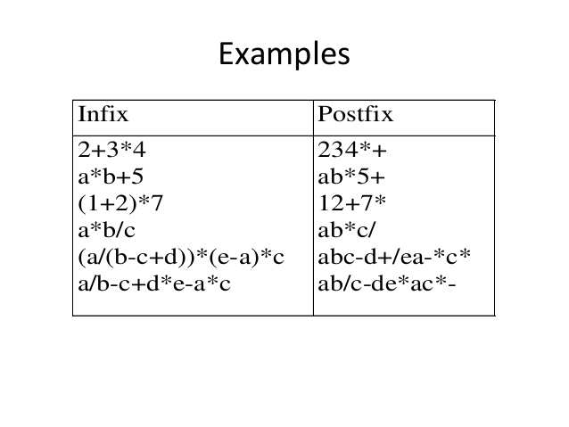
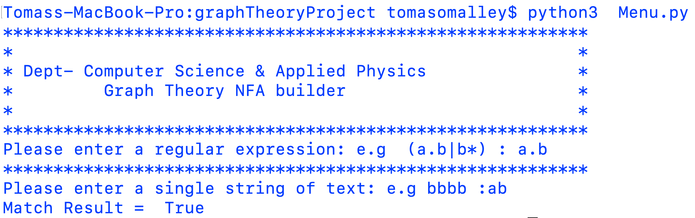

<p align="center"> 
<h1 align="center">Graph Theory NFA Builder </h1>
  
  <a href="https://github.com/github_username/repo">
    
  </a>
  
## Description
 <p align="left">
You must write a program in the Python programming language [2] that can
build a non-deterministic finite automaton (NFA) from a regular expression,
and can use the NFA to check if the regular expression matches any given
string of text. You must write the program from scratch and cannot use the
re package from the Python standard library nor any other external library.
<br />
</p>

| Header | Description |
| --- | --- |
| `Author` | Tomas O'Malley (G00361128)@gmit.ie |
| `Course` | Software Development GA_KSOAG_H08 Y3  |
| `Module` | Graph Theory  |
| `Program` | NFA Graph Theory Project|
| `Langauge` | Python 3|
| `Weighting` | 50% |
| `Year of Study` | 3 |

## Installation
 
- Download [git](https://git-scm.com/downloads) to your machine if not already installed.
- Download [python](https://www.python.org/downloads/) to your machine if not already installed.
_______________________________________________________________________________________________
- Open your systems CLI **Windows Command line** / **MAC OSX Terminal or Linux Terminal**
- Type the follow commands
- git clone  https://github.com/OmalleyTomas98/graphTheoryProject.git
- cd graphTheoryProject
- python3  menu.py


## Features

- Command line interface menu 
- Build a NFA to check a Regular Expression 
- Output whether a match or a mismatch


## Development
  | Header | Description |
| --- | --- |
| `Langauge` | Python 3  |
| `Editor` | Vi |
| `Enviroment` | Google Cloud Linux Debian CLI |


## Research
- **Python**
  - Python is an interpreted, object-oriented, high-level programming language with dynamic semantics. Its high-level built in data structures, combined with dynamic typing and dynamic binding, make it very attractive for Rapid Application Development, as well as for use as a scripting or glue language to connect existing components together. Python's simple, easy to learn syntax emphasizes readability and therefore reduces the cost of program maintenance. Python supports modules and packages
  
<p align="center"> 
 <a href="https://github.com/github_username/repo">
        
  </a>
</p> 

- **Non-deterministic finite automaton** (NFA)
    - A nondeterministic finite automaton (NFA), or nondeterministic finite-state machine, does not need to obey these restrictions. In particular, every DFA is also an NFA. Sometimes the term NFA is used in a narrower sense, referring to an NFA that is not a DFA.
    
<p align="center"> 

  <a href="https://github.com/github_username/repo">
        
  </a>
</p> 

- **Thompson’s construction**
  - In computer science, Thompson's construction algorithm, also called the McNaughton-Yamada-Thompson algorithm[1], is a   method of transforming a regular expression into an equivalent nondeterministic finite automaton (NFA).[2] This NFA can be used to match strings against the regular expression. This algorithm is credited to Ken Thompson.Ken Thompson is an American pioneer of computer science. Thompson worked at Bell Labs for most of his career where he designed and implemented the original Unix operating system. I will be using this algorithm to convert a regular Expression into a NFA.
  
<p align="center"> 

<a href="https://github.com/github_username/repo">
        
  </a>
    </p> 

- **The Shunting yard Algorithm** 
    - In computer science, the shunting-yard algorithm is a method for parsing mathematical expressions specified in infix notation. It can produce either a postfix notation string, also known as Reverse Polish notation, or an abstract syntax tree.
   
 <p align="center"> 

<a href="https://github.com/github_username/repo">
        
  </a>

 </p> 

- **Infix & Postfix Notation**
   - Infix notation is the notation commonly used in arithmetical and logical formulae and statements. It is characterized by the placement of operators between operands—"infixed operators"—such as the plus sign in 2 + 2.
 
    - Postfix Notation. Postfix also known as Reverse Polish Notation (or RPN), is a notational system where the operation/function follows the arguments. For example, "1 2 add" would be postfix notation for adding the numbers 1 and 2.
  
    - Infix notation is simply the way in which humans interact with numbers e.g 2+2=4 , However computers  do not operate in this manner they must use postfix notation e.g 22add . A computer uses a stack data structure to hold and push/pop all the operators e.g (+,-,/) and operanders e.g (1,10,39) 
    
<p align="center"> 

<a href="https://github.com/github_username/repo">
        
  </a>
</p> 

    
- **Regular Expression**
  - A regular expression, regex or regexp is a sequence of characters that define a search pattern. Usually such patterns are used by string searching algorithms for "find" or "find and replace" operations on strings, or for input validation.There are are a large number of regex operators but I will just cover the operators used in my program.
  
   - The integrated common regular expressions in my program :
      
      
            -    Kleene Star   : *
            -    Or            : |
            -    Concatinate.  : .
            -    Example regular in match function of NFA program:
            ___________________________________________________________________
            -    print(match("a.b|b*", "bbbb")) = A and b or Many B's is = "bbb"
            -    Returns True in output
        
  
 - **Pumping lemma** 
    - The pumping lemma is often used to prove that a particular language is non-regular: a proof by contradiction (of the language's regularity) may consist of exhibiting a word (of the required length) in the language that lacks the property outlined in the pumping lemma.

-  **String Matching** 
   - String matching is completed using the match Function: 
   
      ```py 
          def match(regex, s):
           # This function will return true if and only if the regular expression
           # Regex fully matches the string s .It False otherwise.
          # Ask the NFA if it matches the string s.
          return nfa.accept in current
         } 
      ``` 
      
      
## Testing  
  - I conducted a series of short matching tests at the end of the development to determine if the Regular expression operators were working correctly. 
  
  - Here are the examples I tested in the Regex.py File
    ```py 
         tests = [
                         ["a.b|b*" , "bbbb" , True],
                         ["a.b|b*" , "bbxxb" , False],
                         ["a.b" , "ab" , True]

                 ]
      ``` 
  - All the test cases resulted in a pass clause after compiling the class and I was ready to finish the programs Development 
 
## Program Structure
  - There a mulitple files included in this repository which came from adjusting to the python langauge and the google cloud VM enviroment. 
      - Menu.py : In the Menu file is where the program is executed from.It holds the menu system for the user to input a regular expresson + string and outputs the match/mismatch from the Regex.py file on fly as an import.
           ```py 
          import Regex
          
          UserRegex= input("Please enter a regular expression: e.g  (a.b|b*) : ")
          print("**********************************************************")
          s= input("Please enter a single string of text: e.g bbbb :")

          print("Match Result = " , Regex.match(UserRegex,s))
          ```
          
      - Regex.py : The Brains of the program
  
## Program Running
  - Underneath is a screenshot of the program running on my local machine 
<p align="center"> 
        
  </a>
</p> 

## Conclusion
- Overall I was pleased with the application I created and the obstacles of learning a new computing language(Python) and the many algorithms implemented/Researched such as The shunting Yard algorithm and the process of converting infix to postfix.If you apply the commands in this document and run in the correct enviroment you will be successfully able to run this program and build NFAs.  

## References
- [1] Python  https://www.python.org/dev/peps/pep-0008/
- [2] Git Tutorial https://opensource.com/article/18/1/step-step-guide-git
- [3] Python User Input  https://stackoverflow.com/questions/5563089/raw-input-function-in-python
- [4] Thompsons Construction  https://en.wikipedia.org/wiki/Thompson%27s_construction
- [5] PostfixNotation https://wiki.c2.com/?PostfixNotation
- [6] Infix_Notation https://en.wikipedia.org/wiki/Infix_notation
- [7] Pumping Lemma Algorithm https://en.wikipedia.org/wiki/Pumping_lemma_for_regular_languages
- [8] NFA https://en.wikipedia.org/wiki/Nondeterministic_finite_automaton
- [9] Python https://www.python.org/doc/essays/blurb
- [10] vi https://www.guru99.com/the-vi-editor.html
- [11] Google Cloud https://cloud.google.com/gcp/getting-started
